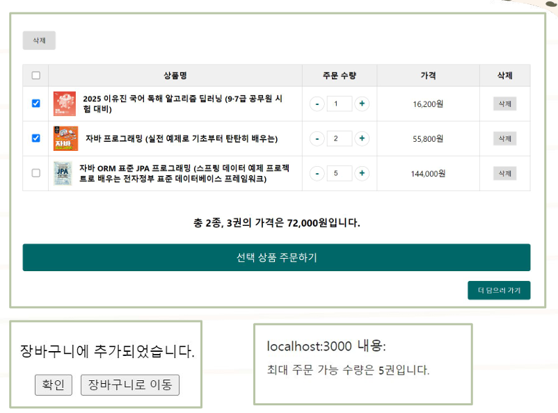

# Book Panda
도서를 사고 팔 수 있는 온라인 서점

## 시연 이미지
- 메인페이지

- 장바구니

- 주문 페이지

- 주문 상세 페이지

- 결제 페이지

## 프로젝트 소개

## ERD

## 회고
- JWT를 이용한 사용자 인증 및 보안 처리
- Nginx 배포 경험
- DB 모델링과 비동기 API 설계의 어려움과 해결 방식

## 향후 개선` 사항
- [] 각 기능별 단위 테스트, 통합 테스트 코드 구현
- [] DB 튜닝(INDEX 추가, 쿼리 최적화 등)
- [] Redis 리팩토링(조회수 동시성 이슈)
- [] CI/CD 파이프라인 구축 (자동 테스트, 배포) -> github Actions 사용